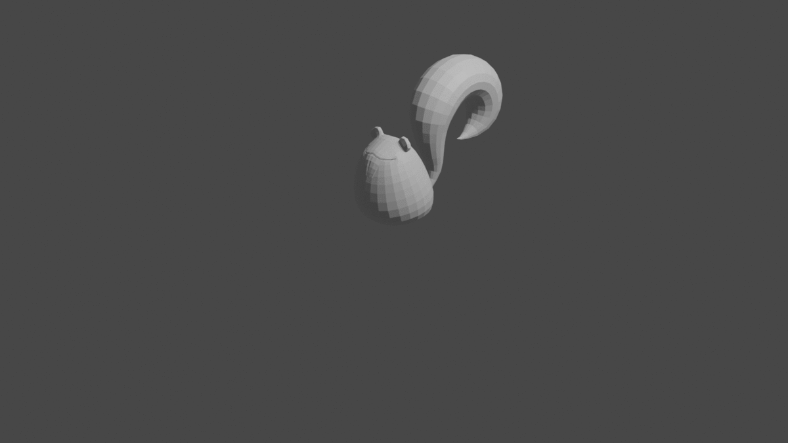
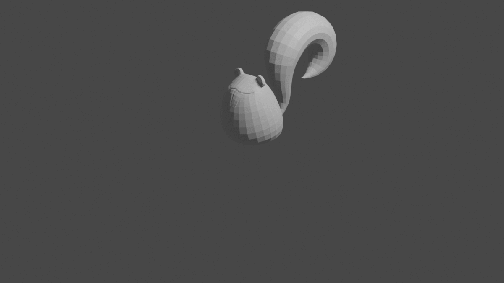
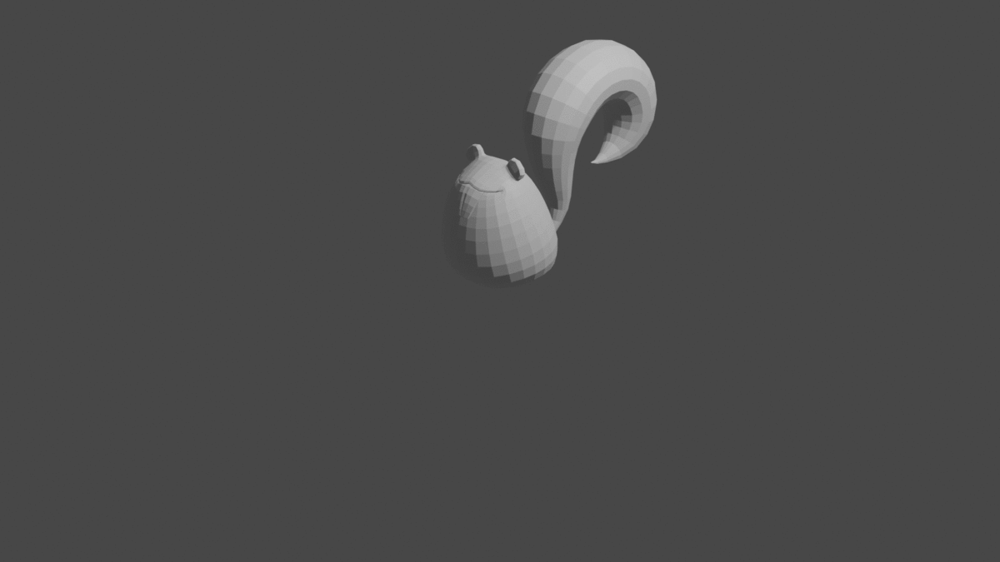

# Homework 3
I implemented basic Catmull-Rom method

Run using the following command
```bash
java -jar hw3.jar [frame rate] [start frame] [end frame] [input file]
```
Generated files will appear in `output` folder. 

Output videos can be found in `videos` folder.
Gifs of `data/input_0*.txt` can be in `gif` folder.








